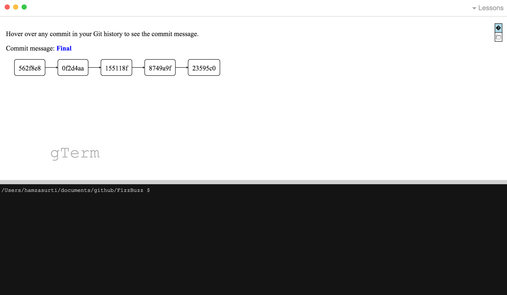
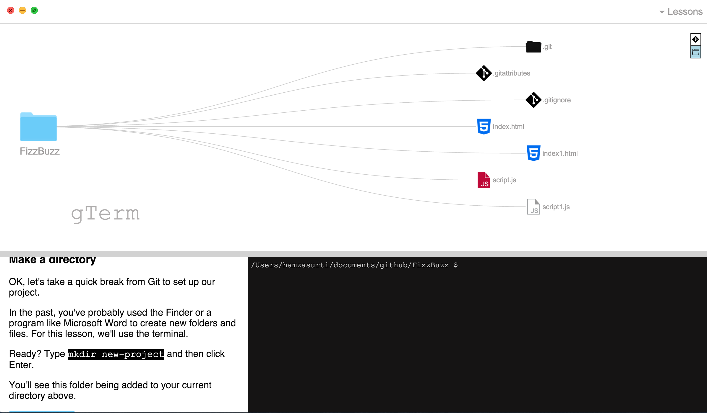

# gTerm
gTerm is a Mac desktop application for beginning developers who are just starting to use Git and the terminal. Built with [Electron](http://electron.atom.io/), gTerm combines a terminal emulator with animations of your file structure and Git status. Our goal is to help you visualize what happens when you run terminal commands.

## Getting started
Currently, gTerm is available only for Mac. To get started...

- Visit [gTerm.xyz](http://gterm.xyz/) and download our ZIP folder.
- Unzip the folder, right-click the gTerm application, and select "Open".
- You may see a warning that gTerm is "from an unidentified developer". Click the "Open" button to access the app.

## Features

### Terminal emulator
You can use the terminal emulator at the bottom of our app just like you'd use your Mac's terminal. When you run a command, you'll see not only the text-based response you expect from your terminal but also a visualization above the emulator.

### File structure animation
When you open gTerm, you'll see your current working directory on the left and all the items inside it on the right. Each item has an icon indicating its file type. Red icons indicate Git-tracked files with uncommitted changes, or folders containing files with uncommitted changes. Black icons indicate hidden Git files and folders.

When you use the terminal emulator to change directories or commit changes, the animation will update automatically. You can also navigate through your file structure by clicking the folder icons in the animation.

To switch to a view of your Git history, use the toggle at the top right of the animation.

### Git animation
This animation shows your current repository's commit history, rendered as a directed acyclic graph. Each commit is represented by its hash. When you hover over any commit, you'll see the commit message associated with it.

If your current directory is not part of a Git repository, this animation will be blank.

### Lesson
For those who are new to the terminal, gTerm includes a lesson on Git and terminal basics, called "Git on your computer". You can access it using the "Lessons" dropdown menu at the top right of the app.

The lesson guides you through the process of running basic commands in our terminal emulator. We'll provide feedback as you go on whether you're running these commands correctly. If you make a mistake, we'll show you a red error message with a helpful hint. Once you've fixed your mistake, you can continue moving through the lesson.

We hope to add more lessons in the future on topics like GitHub.
